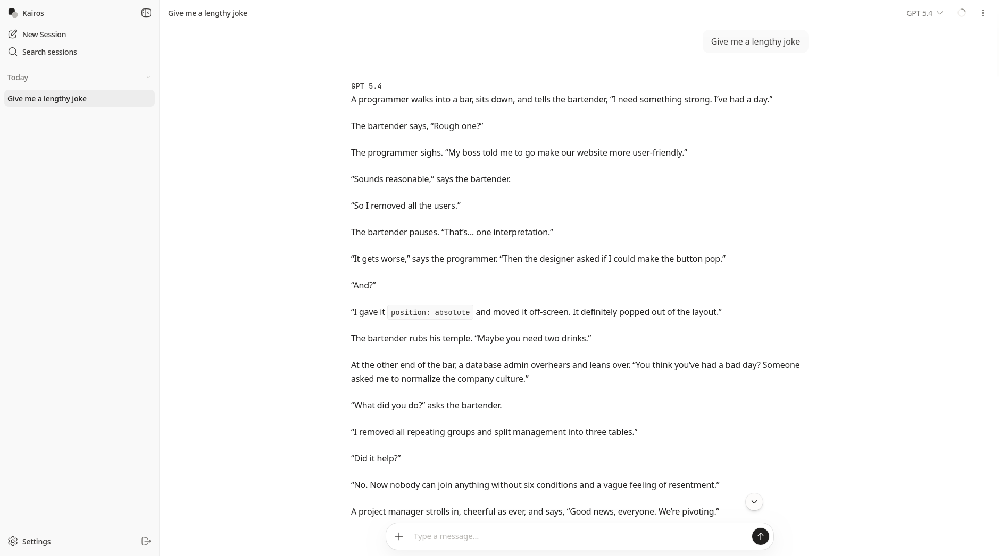
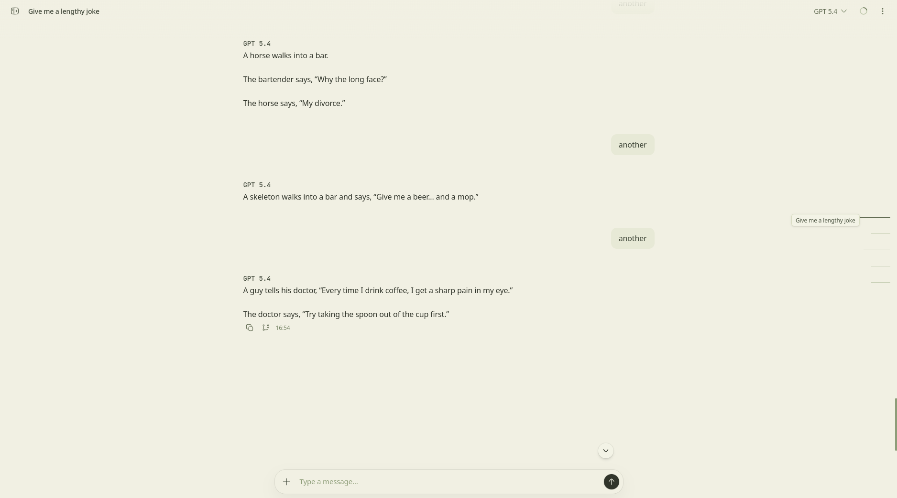
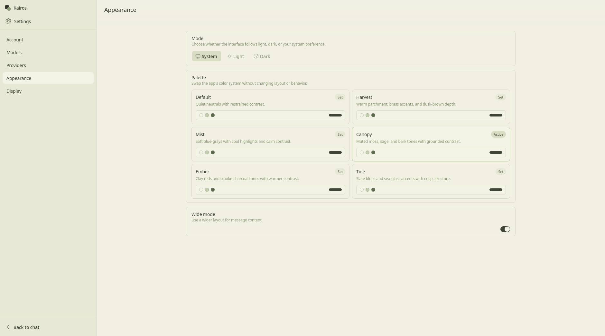

# Kairos

Kairos is a simple focused chat app for talking to LLMs.

It is a lightweight open WebUI alternative for hosted models only: no local model runtime, no heavyweight deployment, just a fast web UI and a Go server you can run as a single service.

## Screenshots







## Development

```bash
pnpm install
pnpm dev
```

Copy `.env.example` to `.env` first if you want to override local defaults. `pnpm dev` starts the Vite frontend on `http://localhost:3000` and the Go backend on `http://localhost:8080`.

## Configuration

Local environment values live in `.env`.

Common settings:

- `HTTP_ADDR` for the server bind address
- `KAIROS_DB_PATH` for the SQLite database path
- `AUTH_ENABLED` to enable authentication
- `ALLOW_SIGNUP` to allow or block self-service signup
- `PROVIDER_SECRET_KEY` for encrypting stored provider credentials
- `BOOTSTRAP_ADMIN`, `ADMIN_EMAIL`, and `ADMIN_PASSWORD` for first admin setup

See [.env.example](.env.example) for the full list.

## Production Build

```bash
pnpm build
go build ./cmd/kairosd
```

`pnpm build` writes the frontend bundle into `internal/server/static`, and the Go binary embeds those assets. The final binary serves both the SPA and `/api/*` from the same origin.

## Credits

The original interface was extracted and adapted from [webclaw](https://github.com/ibelick/webclaw) by [ibelick](https://github.com/ibelick).

## License

See [LICENSE](LICENSE).
